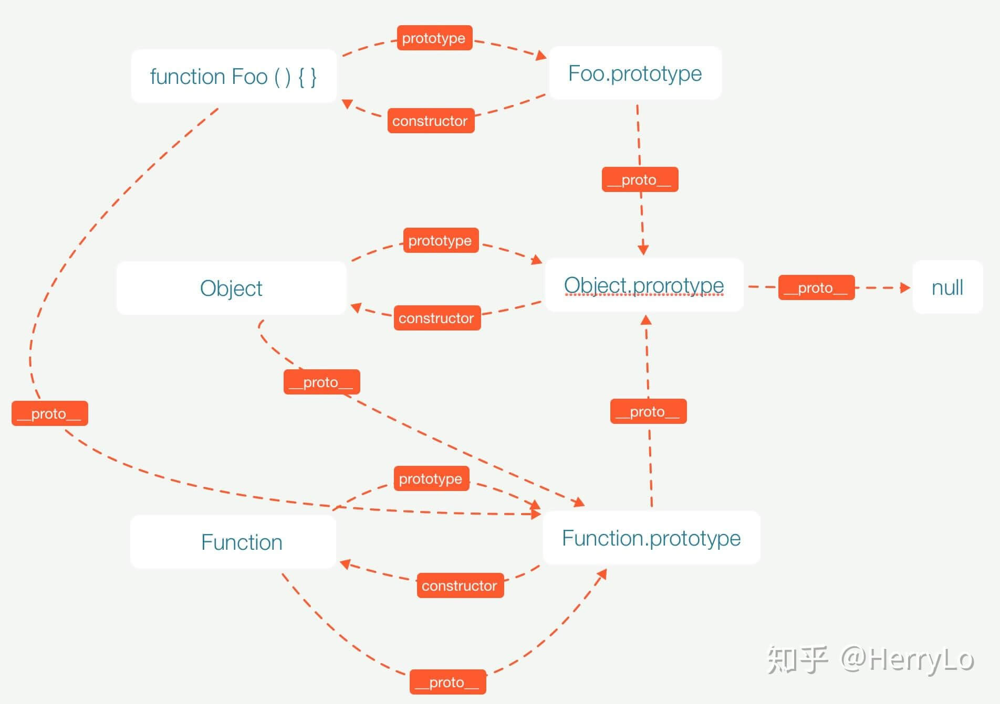

# JavaScript

## 1. 事件代理

借助点击时事件(event)会附带被点击的元素的DOM子树(target)；当给很多元素添加事件的时候，可以给这些元素的
共同父元素添加事件，借助target和事件冒泡传递，使父元素代理子元素的事件处理

## 2. prototype

```javascript
class C {
    a = 1
}

C.prototype.getA = function (x) {
    return this.a + x
}

new C().getA(2)
```

## 3. 闭包

函数和函数内部能访问到的变量的总和，就是一个闭包

function foo是为了证明变量a是局部变量，能达到闭包的目的隐藏变量；
return function bar的目的是为了bar函数能被使用，这两者都与闭包本身无关

闭包的作用是隐藏变量，能让函数外部访问内部隐藏的局部变量，且能保护局部变量不被外部干扰

```javascript
function foo() {
    var a = 1
    return function bar() {
        a += 1
        return a
    }
}

console.log(foo()()) // 2
console.log(a) // a is not defined
```

```javascript
function f(callback) {
    var a = 1
    callback(a)
}

f(a => {
    console.log(a)
})
```

```javascript
for (var i = 0; i < 10; i++) {
    (function (e) {
        setTimeout(function () {
            console.log(e)
        }, 1000)
    })(i)
}
```

## 4. undeclared是语法错误表示没有声明，undefined表示根本未被定义，null是被定义了但是被定义的是空值

## 5. == 相等运算符， === 严格相等运算符

## 6. "use strict"严格模式下，不允许使用未声明的变量

## 7. 编译阶段，函数声明和变量声明会被提前到环境顶部，函数声明的优先级又高于变量声明；据此来分析js代码

## 8. 模块模式，减少命名冲突

```javascript
var m = (function () {
    function a() {
        console.log('a')
    }

    function b() {
        console.log('b')
    }

    return {
        a,
        b
    }
})()

m.a()
```

## 9. call 和 apply 的用法

```javascript
function f1(x, y, z) {
    console.log(x, y, z)
}

function f2(x, y, z) {
    console.log(x, y, z)
    f1.apply(this, arguments)
}
f2.call(this, 1, 2, 3)
```

## 10. async, await 和 Promise

```javascript
function callback({ data, success, fail }) {
    setTimeout(() => {
        if (data.flag) {
            success('success')
        } else {
            fail('error')
        }
    }, 1000)
}

async function asyncPromise(data) {
    return await new Promise((resolve, reject) => {
        callback({
            data: {
                flag: data.flag
            },
            success: res => {
                resolve(res)
            },
            fail: err => {
                reject(err)
            }
        })
    })
}

(async () => {
    let res = await asyncPromise({
        flag: true
    })
    console.log(res)
})()
```

## 11. this在函数中指向全局对象，在方法中指向该方法所属对象

## 12. todo

## 13. 原型链

- ### prototype 和 constructor

js中没有类的概念，ES6中有class关键字模拟了类但并不是真的类

每个函数都有一个原型对象，函数的prototype指向它的原型对象，原型对象的constructor又指回函数本身；
Object,Function也都是函数

- ### __proto__

每个对象(函数也是对象)都有一个__proto__，这个__proto__指向创建它的函数的原型对象；所有的原型对象的__proto__又都指向Object.prototype；
最终Obejct.prototype的__proto__又指向null
当用new关键字使用函数构造一个实例对象的时候，这个对象的__proto__指向创建它的函数的原型对象

```javascript
function foo() {

}

console.log(foo.prototype.constructor === foo)
console.log(Object.prototype.constructor === Object)
console.log(Function.prototype.constructor === Function)

console.log(foo.__proto__ === Function.prototype)
console.log(Object.__proto__ === Function.prototype)
console.log(Function.__proto__ === Function.prototype)

console.log(foo.prototype.__proto__ === Object.prototype)
console.log(Function.prototype.__proto__ === Object.prototype)
console.log(Object.prototype.__proto__ === null)
```



## 14. JavaScript 继承实现

- ### 原型链表实现继承

```javascript
function Super() {
    this.a = 1
}

function Sub() {

}

Sub.prototype = new Super()

var sub = new Sub()
console.log(sub.a)
```

- ### call 实现继承

```javascript
function Super() {
    this.a = 1
}

function Sub() {
    Super.call(this)
}

var sub = new Sub()
console.log(sub.a)
```

- ### 组合继承

```javascript
function Super(a) {
    this.a = a
}

function Sub(a) {
    Super.call(this, a)
}

Sub.prototype = new Super()

var sub = new Sub(1)
console.log(sub.a)
```

## 15. let, var 和 const 的区别

- ### let, const可以定义块级作用域，这里的块级作用域不等于函数，函数内部闭包都会形成新的作用域

```javascript
{
    var a = 1
    let b = 1
    const c = 1
}
console.log(a) // 1
console.log(b) // error: b is not defined
console.log(c) // error: c is not defined
```

- ### let, const不存在变量提升

- ### var 可以声明同名变量

```javascript
var a = 1
var a = 2
let b = 1
let b = 2
console.log(a)
console.log(b) // error
```

- ### const 常量一旦声明不可再修改

```javascript
const c = 1
c = 2
console.log(c) // error: Assignment to constant variable.
```

但是可以修改复杂类型数据的属性

```javascript
const obj = { a: 1 }
obj.a = 2
console.log(obj)
```
